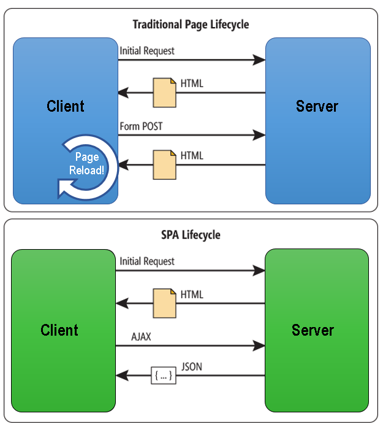

### React.js

> React is a JavaScript library for building user interfaces. 

> It was created by Facebook in 2011, but the initial release for use was in 2013.

> It is maintained by Facebook and a community of individual developers and companies. 

> React can be used as a base in the development of single-page or mobile applications. 

> React allows us to create reusable UI components.

> It is also used in the creation of React Native, a framework for building mobile apps with React.

### Single Page Application [SPA]

> A single-page application (SPA) is a web application that contains a single web page.

  

### React Router

> React Router is a routing library for React.

> It is used to switch between pages in an SPA.

### React Component 
   > It  is a JavaScript function that returns a html. which is written in special syntax called JSX[Javascript XML]. Allowing us to easily combine javascript and html markup.

    > Welcome.jsx

    function Welcome() {
      return <h1>Hello, Queen</h1>;
    }

    {/* Now if you to want make the pass props [properties] to Welcome.jsx component */}

    function Welcome(props) {
      return <h1>Hello, {props.name}</h1>;
    }

    {/* Now if you want to give our component an internal state */}

    > MyComponent.jsx

    [Defining the component in class syntax]

    class MyComponent extends React.Component {
      constructor(props) {
        super(props);
        this.state = {
          name: 'Queen'
        };
      }
      render() {
        return <Welcome name={this.state.name} />;
      }
    }
 
    [Defining the component in function syntax]

    const [name, setName] = useState('Queen');

    function MyComponent() {
      return <Welcome name={name} />;
    }

### Extra information about React.js
1)  Global state management
    > We have many state management libraries available in the React ecosystem. Some of the most popular are Redux, MobX, and Recoil.

2) Static Site Generation
    > For generating static websites, we use the React Static website generator called Gastby.

3) Server Side Rendering
    > React can be used to render the application on the server by using the Next.js framework.

4) For Animations
   > We can use React to create animations using the React Spring library. 
  
5) For Forms
   > We can use React to create forms using the React Forms library called Formik.